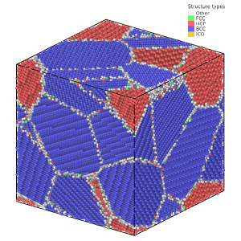

# PolyCrysGen 
<p align="center">
<a href="https://github.com">
  
</a>
  <a href="mailto:stefanbringuier@gmail.com">
    
  </a>
  <a href="https://stefanbringuier.info">
    
  </a>
  <a href="https://github.com/stefanbringuier/PolyCrysGen/actions/workflows/build-and-release.yml">
  
  </a>
</p>


## Description
This is a wrapper-script to generate polycrystalline samples for LAMMPS simulation. It utilizes [ASE (Atomic Simulation Environment)](https://wiki.fysik.dtu.dk/ase) and [Atomsk](https://atomsk.univ-lille.fr/) to create the base unit cells, then multi-phase polycrystalline structures, and write a LAMMPS data file (`atom_style full`). The flags you can pass to the script are simulation box size, elemental phases and number of grains. All grains are randomly oriented, constructed under PBC, and unwrapped with image flags in the data file. Assumes bulk structures are  available from ASE.build.bulk. You should be able to create as many elemental phases+grains as needed.

> Note: Only pure elemental structures that are in `bulk` from `ase.build` are fully covered at the moment. Some compounds are available.

## Usage
If your python setup has [ASE](https://wiki.fysik.dtu.dk/ase/) and your linux environment path includes the [`atomsk`](https://atomsk.univ-lille.fr/) binary, then the [PolyCrysGen.sh](./PolyCrysGen.sh) file can be ran as is by executing in the command line with: `bash PolyCrysGen.sh` or  `chmod +x PolyCrysGen.sh; ./PolyCrysGen.sh`.

Optionally, I have put together a portable `x86_64` [AppImage](https://github.com/stefanbringuier/PolyCrysGen/releases) release which you can download and then in a Linux terminal:

```shell
chmod +x PolyCrysGen.AppImage
./PolyCrysGen.AppImage --help
```
> Note: I have only tested the AppImage on Ubuntu and requires you install `libfuse2` (`apt install libfuse2`)

**Example:**

`./PolyCrysGen.AppImage --size "150 150 150" --phases "Fe:6 Mg:2 Cr:2 " --postfix "FeMgCr_Polycrystal"`

 


**Options:**
- `-s, --size SIZE`: Define the box size as "X Y Z". Default is "50 50 50".
- `-p, --phases PHASES`: Specify phases and number of grains "Element1:N-Grains Element2:M-Grains". Default is "Si:2 Ge:3".
- `-x, --postfix POSTFIX`: Set a postfix for the generated files. Default is "Polycrystal".

### Notes on running

The script will prompt you in the beginning to remove any file formats that are used in the workfow, if you don't do anything after 10 seconds it will default to `n`. This can have unintended consequences and is more of a check so you don't delete anything you wanted to preserve. You usually want to use `y`.

At the end you will also be prompted if you want to delete any output files, if your wanting to inspect the grain locations and detail you'll want to use `y` to save these. They are the `.txt` files.

## TODO
- [x] Add logic for 1 phase.
- [ ] Verify 4+ phases (I believe the logic require alphabetic ordering in `--phases` arg?)
- [x] Add support for compound phases (ex. SiC) [**Partial List**]

## References
1. P. Hirel, Atomsk: A tool for manipulating and converting atomic data files, Computer Physics Communications 197 (2015) 212–219. [https://doi.org/10.1016/j.cpc.2015.07.012](https://doi.org/10.1016/j.cpc.2015.07.012).
2. A. Hjorth Larsen, et al., The atomic simulation environment—a Python library for working with atoms, J. Phys.: Condens. Matter 29 (2017) 273002. [https://doi.org/10.1088/1361-648X/aa680e](https://doi.org/10.1088/1361-648X/aa680e).

